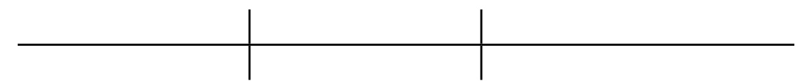
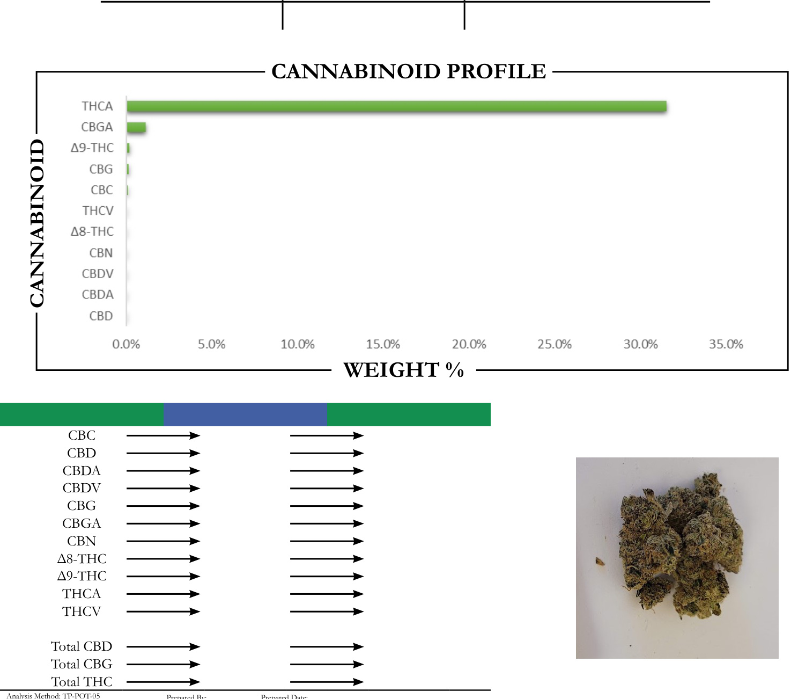
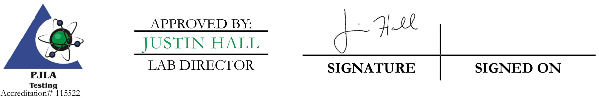

REPORT PREPARED FOR:  

PROJECT# LAB ID REPORT DATE  

SAMPLE NAME: DATE RECEIVED:  

  

  

By HPLC-VWD   
Total THC = (0.877 x  THCA) + Δ9-THC Analyzed By: Date Analyzed:   
Total CBD = (0.877 x  CBDA) + CBD Analysis Batch:   
Total CBG = (0.877 x  CBGA) + CBG   
$\mathrm{ND}=$ Not Detected  

  